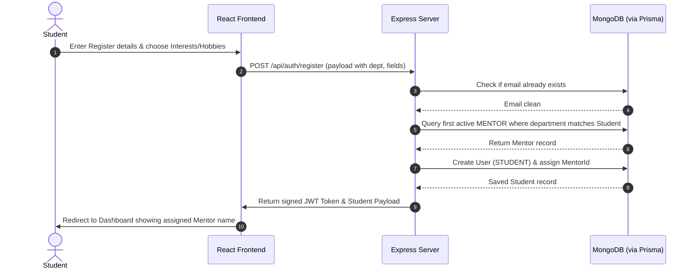
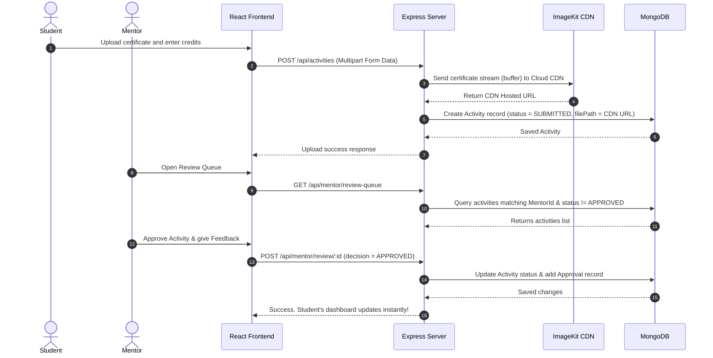

# EduTrack: Student Curriculum & Activity Tracking System
## 🏆 Judge Presentation Pitch & Evaluation Guide

This document contains a comprehensive project blueprint, architecture breakdown, software development lifecycle (SDLC), code snippets, and a ready-to-use **evaluation test bed** designed for project judges or system coordinators.

---

## 📌 1. Project Overview & Pitch
**EduTrack** is a role-based, data-driven web portal designed to monitor and visualize undergraduate student progress across academic, co-curricular, and extracurricular activities.

### The Problem it Solves:
- **Disjointed Academic Portfolios:** Student achievements are scattered across emails, spreadsheets, and physical printouts.
- **Mentor Tracking Overload:** Mentors struggle to follow student progress outside the classroom, leading to missed student gaps.
- **Extracurricular Neglect:** Students often ignore their non-academic hobbies, leading to unbalanced portfolios.

### The EduTrack Solution:
1. **Curated Profiles:** Multi-step registration tracks Student Details, Tech Focus areas, and Extracurricular Hobbies.
2. **Dynamic Gap Identification:** The system proactively warns students if they have not participated in their hobbies (extracurricular gap) or technology interests (academic/skills gap).
3. **Department-Locked Mentorship:** CSE students are automatically assigned to CSE mentors, IT students to IT mentors.
4. **Cloud-Driven Portfolios:** Powered by **ImageKit CDN** for secure, high-speed document and certificate storage.
5. **Aesthetic Dashboard:** Beautiful blue/slate dark-navy card layout designed for readability.

---

## ⚙️ 2. Tech Stack & Architecture

EduTrack is built on a **decoupled Client-Server Architecture** using modern, production-grade tools:

```mermaid
graph TD
  subgraph Frontend (React + Vite)
    UI[TailwindCSS / UI Components] --> Routes[React Router DOM]
    Routes --> Context[AuthContext & Axios Service]
  end

  subgraph Cloud Services
    IK[ImageKit CDN / File Upload Storage]
  end

  subgraph Backend (Node.js + Express)
    Auth[JWT Authentication & Middleware] --> API[Express API Handlers]
    API --> Prisma[Prisma ORM Client]
  end

  subgraph Database
    DB[(MongoDB Atlas)]
  end

  Context -- API Calls (HTTPS) --> Auth
  API -- File Streams --> IK
  Prisma -- Queries --> DB
```

- **Frontend:** React 19, TypeScript, Vite, TailwindCSS (v4), Lucide Icons, Recharts (visual progress charting).
- **Backend:** Node.js, Express, TypeScript, JWT (token-based stateless auth), Multer (memory buffer storage).
- **Database Layer:** Prisma ORM connecting to a MongoDB cloud database.
- **Assets CDN:** ImageKit CDN integration for lightning-fast file/credential retrieval.

---

## 🔄 3. Key Core Workflows (Sequence Diagrams)

### A. Student Registration & Automatic Department Mentor Assignment


### B. Activity Submission, CDN Storage & Verification


---

## 🛠️ 4. The Developer Test Bed (Judge Demo Guide)
Use these pre-seeded accounts to demonstrate live features during your presentation:

### 👤 Demo Accounts

| Role | Username / Email | Password | Purpose |
|---|---|---|---|
| **Admin** | `admin@tracker.com` | `Welcome@123` | Control system configurations, audit logs, and assign user roles. |
| **CSE Mentor** | `welcomecse@tracker.com` | `Welcome@123` | View assigned CSE students, review/approve submissions. |
| **IT Mentor** | `welcomeit@tracker.com` | `Welcome@123` | View assigned IT students and review IT submissions. |

---

### 🏃 Step-by-Step Presentation Script

#### Step 1: The Gap-Reminder Demo (Registration Flow)
1. Navigate to the registration page.
2. Register a new student:
   - **Name:** `Anya Sen`
   - **Email:** `anya@university.edu`
   - **Department:** `Computer Science (CSE)`
3. On Step 2, select **"⚽ Sports"** and **"🎵 Music"** as Hobbies, and **"🤖 AI / ML"** as a Tech Interest. Click **Create Account**.
4. Log in as Anya. Point out the **Activity Gap Reminders** card displaying:
   - *“⚠️ You haven't participated in your hobby: Sports, Music. This indicates a gap in your co-curricular/extracurricular development.”*
   - *“⚠️ You have no recent approved submissions for: AI / ML. Consider completing matching projects or research to fill your academic skills gap.”*

#### Step 2: Auto-Department Mentor Assignment
1. On Anya's Student Dashboard, point to the **Mentor** widget.
2. Show that Anya is automatically assigned to **Prof. Sharma** (the pre-assigned CSE Mentor) because Anya registered as a CSE student. No manual coordination was required.

#### Step 3: Activity Upload & CDN Storage
1. Click **Upload Activity**.
2. Fill out:
   - **Title:** `Music Concert Violin Solo`
   - **Type:** `Sports` (or another appropriate category)
   - **Credits:** `2`
   - **Attachment:** Upload any sample image or PDF.
3. Submit. Note that the upload goes to the cloud CDN, returning a hosted URL instantly.

#### Step 4: Mentor Review & Verification
1. Sign out of the student profile and sign in as **Prof. Sharma** (`welcomecse@tracker.com`).
2. Go to the **Review Queue** tab.
3. Find Anya's violin submission, review the CDN attachment, write feedback: *"Excellent extracurricular performance, approved!"*, and click **Approve**.
4. Sign back in as Anya. The **Gap Reminders** card will automatically remove the **"Music"** reminder warning, proving active extracurricular tracking.

---

## 📝 5. Clean Production Code Snippets

### A. Dynamic Gap Identification Logic (Frontend)
Located in [StudentDashboard.tsx](file:///c:/Users/Adrija/Downloads/student-activity-tracker-main/frontend/src/pages/StudentDashboard.tsx):
```typescript
const interests = user?.interestedFields || [];

// 1. Extracurricular/Hobby Gap Filtering
const missingHobbies = interests.filter(item => {
  const isHobby = ['⚽', '🎵', '💃', '🎨', '🎮', '📚', '📸', '✈️', '🍳', '🎭', 'sports', 'music', 'dance', 'art', 'gaming', 'reading', 'photo', 'travel', 'cook', 'theatre'].some(kw => item.toLowerCase().includes(kw));
  if (!isHobby) return false;
  
  const cleanField = item.replace(/[\uE000-\uF8FF]|\uD83C[\uDC00-\uDFFF]|\uD83D[\uDC00-\uDFFF]|[\u2011-\u26FF]|\uD83E[\uDD10-\uDDFF]/g, '').trim().toLowerCase();
  
  return !activities.some(act => 
    act.status === 'APPROVED' && 
    (act.title.toLowerCase().includes(cleanField) || 
     act.description.toLowerCase().includes(cleanField) ||
     act.type.toLowerCase().includes(cleanField))
  );
});

// 2. Academic/Technical Gap Filtering
const missingAcademics = interests.filter(item => {
  const isHobby = ['⚽', '🎵', '💃', '🎨', '🎮', '📚', '📸', '✈️', '🍳', '🎭', 'sports', 'music', 'dance', 'art', 'gaming', 'reading', 'photo', 'travel', 'cook', 'theatre'].some(kw => item.toLowerCase().includes(kw));
  if (isHobby) return false;
  
  const cleanField = item.replace(/[\uE000-\uF8FF]|\uD83C[\uDC00-\uDFFF]|\uD83D[\uDC00-\uDFFF]|[\u2011-\u26FF]|\uD83E[\uDD10-\uDDFF]/g, '').trim().toLowerCase();
  
  return !activities.some(act => 
    act.status === 'APPROVED' && 
    (act.title.toLowerCase().includes(cleanField) || 
     act.description.toLowerCase().includes(cleanField) ||
     act.type.toLowerCase().includes(cleanField))
  );
});
```

### B. Auto-Department Assignment Logic (Backend)
Located in [routes/auth.ts](file:///c:/Users/Adrija/Downloads/student-activity-tracker-main/backend/src/routes/auth.ts):
```typescript
let mentorId: string | null = null;
if (user.role === 'STUDENT') {
  // Query first active MENTOR belonging to the same department
  const defaultMentor = await prisma.user.findFirst({
    where: { 
      role: 'MENTOR', 
      department: user.department || undefined, 
      isActive: true 
    },
  });
  
  if (defaultMentor) {
    await prisma.user.update({
      where: { id: user.id },
      data: { mentorId: defaultMentor.id },
    });
    mentorId = defaultMentor.id;
  }
}
```

---

## 📈 6. Software Development Lifecycle (SDLC)
EduTrack was developed using an **Agile/Iterative Software Development Model**:

1. **Requirements Gathering & Analysis:** Defined separate dashboards for students, mentors, and administrators. Defined rules for automatic mentor routing.
2. **Database Modeling:** Modeled schemas using Prisma, designing one-to-many relationships for student-mentor connections and activity approvals.
3. **Incremental Development Sprints:**
   - *Sprint 1:* Set up authentication models and database pipelines.
   - *Sprint 2:* Developed upload utilities, CDN storage, and approval routers.
   - *Sprint 3:* Integrated profile tags, gap-reminders alerts, and polished UI styles.
4. **Unit & Integration Testing:** Conducted local build validation. Checked endpoint logic with mock request bodies.
5. **Deployment:** Structured repository for multi-service deployment configurations on Render.
